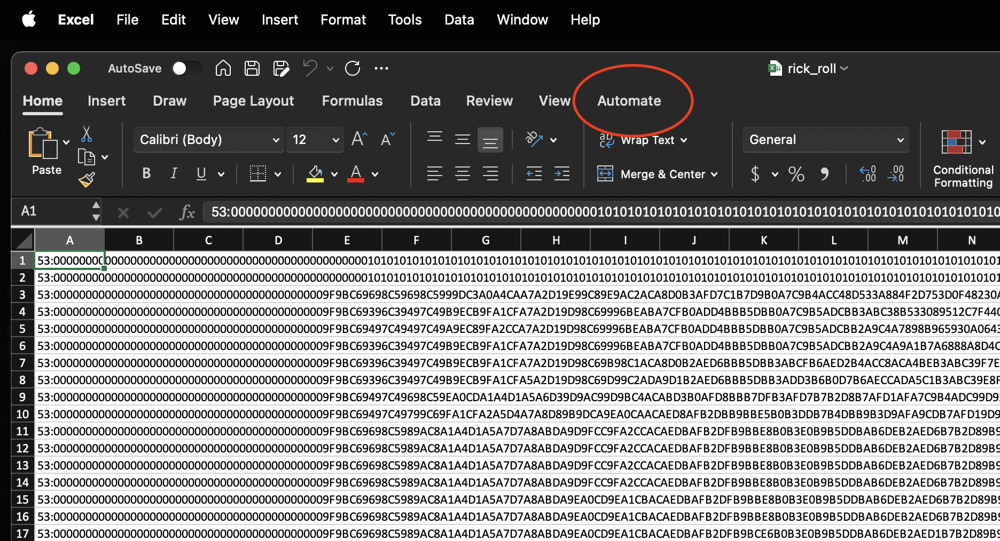
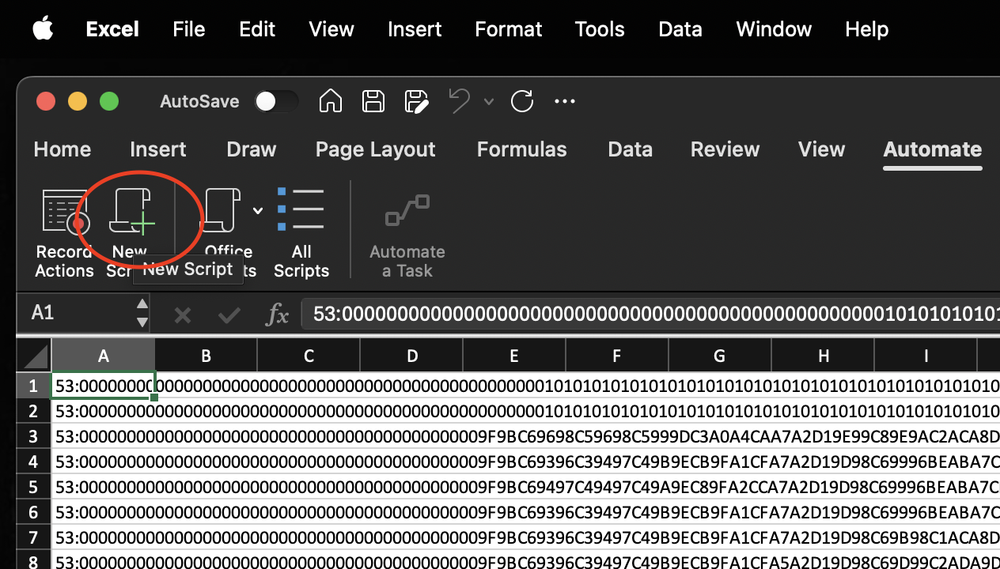
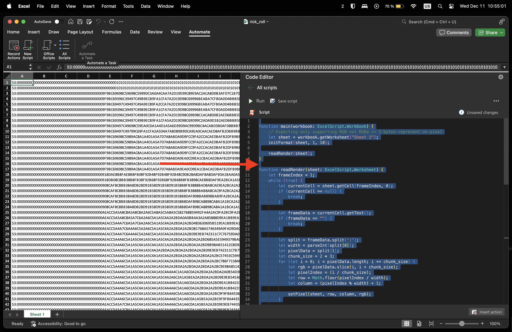

# Xlsxc

## Attention!
Currently xlsxc is only tested on OSX, but probably runs on other UNIX like operating systems like linux.

## Dependencies
### EXCEL
The rendering code is written in office script. Therefore an [office 365 enterprise](https://techcommunity.microsoft.com/blog/excelblog/office-scripts-is-now-available-for-office-365-enterprise-e1-and-office-365-f3-l/4089088) version is needed.

### BUILD
Xlsxc is written in rust and therefore needs to be build from source via cargo.

### CLI
The converter calls the dependent libs via the command line. Make sure to have the needed dependencies as cli tools installed.
- [ty-dlp](https://github.com/yt-dlp/yt-dlp)
- [ffmpeg](https://www.ffmpeg.org)

## What the code does
1. Parse command line input
2. Dowloads the src video from provided url
3. Extracts the frames of the video
4. Reads pixel color values of each frame (i made that process multithreaded, because it took relatively long. All threads are managed by the ImageDataReaderManager)
6. Write all pixel color values (rgb) for each frame into its own cell
7. Each frame cell is located in the first column and contains the width of the frame and the color values seperated by a `:`
8. Afterwards the provided office script reads each frame (cell)
9. The frame data will be chunked into strings of len 6 (HexCode for rgb is represented as 6 bytes/chars)
10. Than each chunk gets iterated and each cell in row is colored
11. If the chunk index exceeds the frame with, than the writing will do a linebreak and write in the next row

## How to use
Clone the repo or download the excetuable (xlsxc/executable):
- xlsxc_aarch64-apple-darwin for *Apple Silicon*
- xlsxc_x86_64-apple-darwin for *x86_64*

And download the rendering script (xlsxc/scripts):
- xlsx_render.ts

### CLI
Help:
```zsh
./xlsxc_aarch64-apple-darwin --help

# Console output
#       |
#       V
Usage: xlsxc_aarch64-apple-darwin [OPTIONS] --src-url <SRC_URL> --out-path <OUT_PATH>

Options:
  -s, --src-url <SRC_URL>    URL of the srouce youtube video
  -t, --tmpdir <TMPDIR>      Optional -> System temp dir can be overriden [env: TMPDIR=/var/folders/h9/4gqv88mx6mxfkw6z4xjhsflc0000gn/T/] [default: /var/folders/h9/4gqv88mx6mxfkw6z4xjhsflc0000gn/T/]
  -r, --ratio <RATIO>        Ratio of frame compression. A ratio of 10/1 means only every tenth frame will be extracted [default: 20/1]
      --width <WIDTH>        Width (in cells) of the video in the excel file [default: 32]
      --height <HEIGHT>      Height (in cells) of the video in the excel file [default: 32]
  -o, --out-path <OUT_PATH>  Output path of the excel file
  -h, --help                 Print help
```

Example:
```zsh
./xlsxc_aarch64-apple-darwin -s https://www.youtube.com/watch?v=dQw4w9WgXcQ -r 25/1 --width 53 --height 32 -o ~/rick_roll.xlsx
```
- Downloads video from src: -s https://www.youtube.com/watch?v=dQw4w9WgXcQ
- Extracts every 25th frame: -r 25/1
- Sets excel render width: --width 53
- Sets excel render height: --height 32
- Output to excel file: -o ~/rick_roll.xlsx

### EXCEL
1. Open the created excel file
2. Change to Automation 
3. Add new Office Script 
4. Copy all of the contents of the xlsx_render.ts file into the newly created script 
5. Run
